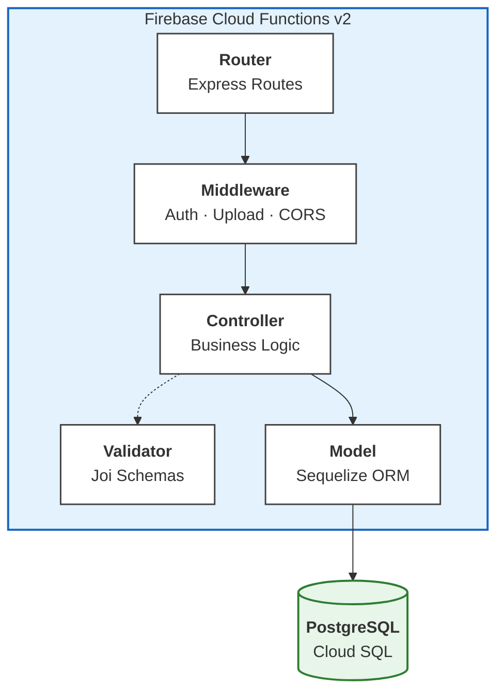
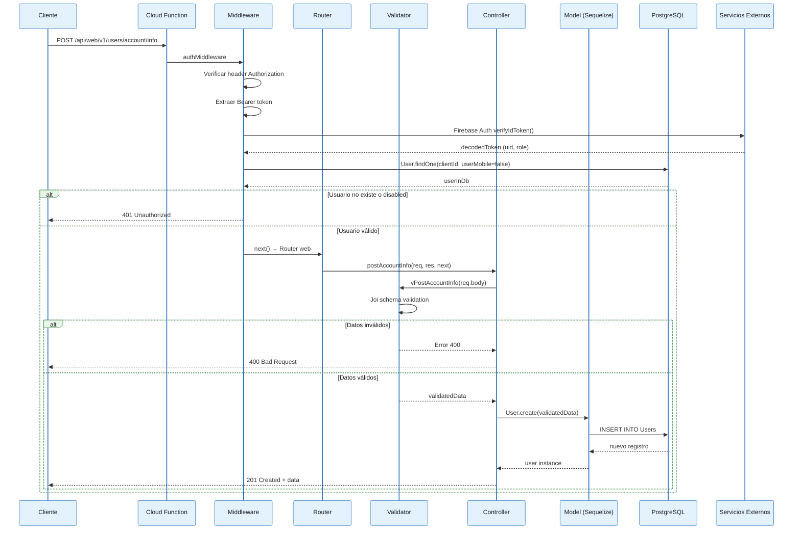
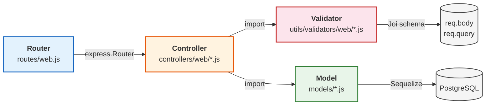
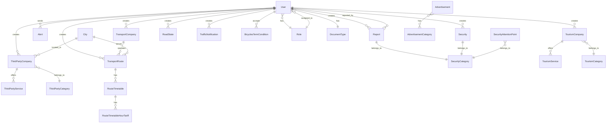
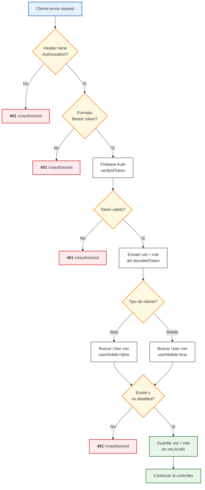
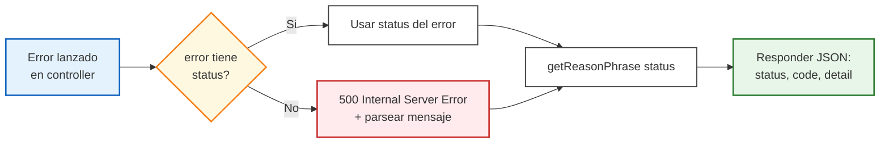

# DOCS.md — Documentacion de Arquitectura

> App Ciudadana — Backend API para la Alcaldía de Cali

---

## 1. Vision General

### 1.1 Que es el proyecto

Backend monolítico que expone una API REST para la aplicación móvil y panel web de la App Ciudadana de la Alcaldía de Cali. Centraliza gestión de usuarios, notificaciones de seguridad, tráfico/movilidad, terceros (turismo y transporte intermunicipal), gestión de archivos y administración de roles.

### 1.2 Patron Arquitectonico

El proyecto sigue un patron **Router-Controller-Model con validacion externa**, una variante del MVC adaptado a Express.js donde:

- **Router** — Define las rutas HTTP y encadena middlewares (auth, upload, controller).
- **Controller** — Maneja la logica de negocio, interactua con modelos y responde al cliente.
- **Validator** — Modulo separado que usa Joi para validar entradas antes de llegar al controller.
- **Model** — Modelos Sequelize que definen esquemas, asociaciones y hooks de base de datos.
- **Middleware** — Capa transversal (auth, error handling, upload, CORS).



### 1.3 Principios de Diseño

1. **Separacion Web/Movil** — Cada microservicio tiene rutas independientes para panel web (`/api/web/v1/...`) y app movil (`/api/mobile/v1/...`).
2. **Auth centralizado** — Firebase Auth verifica tokens; middleware consulta la BD para validar estado del usuario.
3. **Validacion externa** — Joi schemas en modulos `utils/validators/`, no embebidos en controllers.
4. **Soft-delete** — Modelos usan `paranoid: true` en Sequelize.
5. **Multi-inquilino implícito** — Diferenciacion entre usuarios web y movil mediante campo `userMobile`.

---

## 2. Diagrama de Arquitectura General

```mermaid
graph TB
    subgraph Clientes["<b>Clientes</b>"]
        WEB["<b>Panel Web</b><br/>Administradores"]
        MOBILE["<b>App Móvil</b><br/>Ciudadanos"]
    end

    subgraph FC["<b>Firebase Cloud Functions v2</b>"]
        subgraph Entry
            FUNC["<b>appCiudadanaApi</b><br/>onRequest handler"]
        end

        subgraph Mid["Middlewares"]
            AUTH["authMiddleware"]
            AUTH_M["authMiddlewareMobile"]
            ERR["errorMiddleware"]
            UPL["uploadMiddleware<br/>Busboy"]
            CORS["CORS"]
            BPARSER["body-parser"]
        end

        subgraph Routers["Routers Express"]
            R_ADMIN["admin Router"]
            R_ROLE["role Router"]
            R_USERS_WEB["users web Router"]
            R_USERS_MOB["users mobile Router"]
            R_NOTIF_WEB["notifications web Router"]
            R_NOTIF_MOB["notifications mobile Router"]
            R_THIRD_WEB["thirdParties web Router"]
            R_THIRD_MOB["thirdParties mobile Router"]
            R_TRAFFIC_WEB["traffic web Router"]
            R_TRAFFIC_MOB["traffic mobile Router"]
            R_UPLOAD["file upload Router"]
            R_DOWNLOAD["file download Router"]
        end
    end

    subgraph Data["<b>Capa de Datos</b>"]
        DB[("<b>PostgreSQL</b><br/>37 modelos")]
    end

    subgraph Ext["<b>Servicios Externos</b>"]
        FB_AUTH["Firebase Auth"]
        FB_STORAGE["Firebase Storage"]
        FCM["FCM Push"]
        MAIL["nodemailer"]
        SMS["Sigma SMS"]
    end

    WEB -->|HTTPS| FUNC
    MOBILE -->|HTTPS| FUNC

    FUNC --> CORS
    CORS --> BPARSER
    BPARSER --> R_ADMIN
    BPARSER --> R_USERS_WEB
    BPARSER --> R_USERS_MOB
    BPARSER --> R_NOTIF_WEB
    BPARSER --> R_NOTIF_MOB
    BPARSER --> R_THIRD_WEB
    BPARSER --> R_THIRD_MOB
    BPARSER --> R_TRAFFIC_WEB
    BPARSER --> R_TRAFFIC_MOB
    BPARSER --> R_UPLOAD
    BPARSER --> R_DOWNLOAD

    R_ADMIN --> AUTH
    R_USERS_WEB --> AUTH
    R_NOTIF_WEB --> AUTH
    R_THIRD_WEB --> AUTH
    R_TRAFFIC_WEB --> AUTH
    R_UPLOAD --> UPL

    R_USERS_MOB --> AUTH_M
    R_NOTIF_MOB --> AUTH_M
    R_THIRD_MOB --> AUTH_M
    R_TRAFFIC_MOB --> AUTH_M

    R_ADMIN -.->|404| ERR
    R_USERS_WEB -.->|404| ERR

    R_ADMIN --> Data
    R_USERS_WEB --> Data
    R_NOTIF_WEB --> Data
    R_THIRD_WEB --> Data
    R_TRAFFIC_WEB --> Data
    R_UPLOAD --> Data

    Data --> DB

    Data -.-> FB_AUTH
    Data -.-> FB_STORAGE
    Data -.-> FCM
    Data -.-> MAIL
    Data -.-> SMS

    classDef client fill:#FFF3E0,stroke:#E65100,stroke-width:2px
    classDef fc fill:#E3F2FD,stroke:#1565C0,stroke-width:2px
    classDef data fill:#E8F5E9,stroke:#2E7D32,stroke-width:2px
    classDef ext fill:#F3E5F5,stroke:#7B1FA2,stroke-width:2px
    classDef comp fill:#FFFFFF,stroke:#424242,stroke-width:1.5px

    class Clientes client
    class FC,Entry,Mid,Routers fc
    class Data,DB data
    class Ext,FB_AUTH,FB_STORAGE,FCM,MAIL,SMS ext
    class WEB,MOBILE,FUNC,AUTH,AUTH_M,ERR,UPL,CORS,BPARSER,R_ADMIN,R_ROLE,R_USERS_WEB,R_USERS_MOB,R_NOTIF_WEB,R_NOTIF_MOB,R_THIRD_WEB,R_THIRD_MOB,R_TRAFFIC_WEB,R_TRAFFIC_MOB,R_UPLOAD,R_DOWNLOAD comp
```



---

## 3. Flujo de una Peticion HTTP



---

## 4. Estructura del Proyecto

```
src/
├── functions.js                 # Entry point Firebase Cloud Functions v2
├── app.js                       # Aplicación Express (configura routes y middlewares)
├── all-server.js                # Entry point desarrollo local (listen en puerto)
├── package.json                 # Dependencias y scripts
│
├── config/                      # Configuración
│   ├── dotenv.js                # Carga de .env según NODE_ENV
│   ├── config.js                # Config Sequelize para CLI (migraciones)
│   ├── utc_zone.json            # Zona horaria UTC
│   ├── microservices_urls.json  # URLs de microservicios
│   └── account_service_key*.json# Cuentas de servicio Firebase (gitignored)
│
├── middleware/                  # Capa transversal
│   ├── authMiddleware.js        # Auth Firebase Admin (web + mobile + permisos)
│   ├── authMiddlewareApi.js     # Auth alternativo para APIs de terceros
│   ├── errorMiddleware.js       # Handler global de errores Express
│   ├── uploadMiddleware.js      # Upload de archivos con Busboy
│   └── formatDate.js            # Utilidad de formato de fechas
│
├── models/                      # Modelos Sequelize (37 archivos, 1 por entidad)
│   ├── index.js                 # Auto-carga de modelos + conexión DB
│   ├── user.js
│   ├── role.js
│   ├── report.js
│   ├── alert.js
│   ├── security.js
│   └── ... (32 mas)
│
├── migrations/                  # Migraciones Sequelize
├── seeders/                     # Seeders iniciales
│
├── utils/                       # Utilidades compartidas
│   ├── firebaseAdmin.js         # Funciones auxiliares Firebase (usuarios, FCM)
│   ├── sendMail.js              # Envío de correos (nodemailer/sendgrid)
│   ├── polygonCali.js           # Polígono geográfico de Cali
│   ├── tryRetry.js              # Retry con reintentos
│   ├── uriTransformer.js        # Transformación de URIs
│   ├── utcZone.js               # Configuración de zona horaria
│   ├── validator.js             # Validator genérico
│   └── policiesManager.js       # Gestión de políticas de acceso
│
└── microservices/               # Módulos de negocio (6 microservicios)
    ├── admin/                   # Administración de usuarios y roles
    ├── notifications/           # Notificaciones, seguridad, reportes
    ├── users/                   # Gestión de usuarios y tipos de documento
    ├── thirdParties/            # Terceros: turismo, transporte, taxis
    ├── traffic/                 # Tráfico: estado de vías, bicicletas
    └── fileManagement/          # Subida y descarga de archivos
```

---

## 5. Patron de Microservicios Interno

Cada "microservicio" dentro del proyecto sigue la misma estructura interna:

```
microservices/<nombre>/
├── index.js                     # Entry point standalone (legacy Cloud Run)
├── Dockerfile                   # Docker (legacy)
├── v1/
│   ├── routes/
│   │   ├── web.js               # Rutas para panel web
│   │   └── mobile.js            # Rutas para app móvil
│   └── controllers/
│       ├── web/
│       │   ├── <entidad1>.js    # Controller web entidad 1
│       │   └── <entidad2>.js    # Controller web entidad 2
│       └── mobile/
│           ├── <entidad1>.js    # Controller mobile entidad 1
│           └── <entidad2>.js    # Controller mobile entidad 2
└── utils/
    ├── validators/
    │   ├── web/
    │   │   └── <entidad>.js     # Joi schemas para web
    │   └── mobile/
    │       └── <entidad>.js     # Joi schemas para mobile
    └── accessCheck.js           # Verificación de permisos
```

### 5.1 Flujo interno de cada microservicio



### 5.2 Responsabilidades por capa

| Capa | Ubicacion | Responsabilidad |
|---|---|---|
| **Router** | `v1/routes/web.js`, `v1/routes/mobile.js` | Definir endpoints HTTP, encadenar middlewares, mapear a controllers |
| **Controller** | `v1/controllers/web/*.js`, `v1/controllers/mobile/*.js` | Logica de negocio, orquestar validacion + modelo, responder HTTP |
| **Validator** | `utils/validators/web/*.js`, `utils/validators/mobile/*.js` | Esquemas Joi, validacion de entrada, limpieza de datos (`stripUnknown`) |
| **Model** | `models/<entidad>.js` | Esquema de tabla, asociaciones Sequelize, hooks, soft-delete |
| **Middleware** | `middleware/*.js` | Auth, upload, error handling — transversal a todos los microservicios |

---

## 6. Modulos de Negocio

### 6.1 Users

**Responsabilidad:** Gestión de usuarios (registro, login progresivo, tipos de documento).

**Patron de login:** Flujo en fases que guía al usuario por pasos:
```
notRegistered → baseLogin → inVerification → fullLogin
```

**Entidades:** User, DocumentType

**Caracteristicas:**
- Login progresivo con validacion de fase
- Distincion entre usuario web y movil (`userMobile`)
- Validacion geográfica de lat/lon contra polígono de Cali

### 6.2 Notifications

**Responsabilidad:** Modulo mas grande. Gestiona notificaciones, reportes de seguridad, puntos de atención, líneas de atención, géneros, redes sociales, servicios móviles, dependencias y alertas.

**Entidades:** Alert, Report, ReportConfiguration, ReportStatus, Security, SecurityCategory, SecurityAttentionPoint, AttentionLine, GenderAttentionLine, GenderAttentionPoint, GenderCategory, SocialNetwork, SocialNetworkType, MobileService, Dependency, Advertisement, AdminNotification

**Caracteristicas:**
- Reportes geolocalizados con distancia
- Sistema de aprobación de reportes
- Carga masiva de dependencias via Excel
- Alertas push (FCM) y SMS (Sigma)
- Categorización de publicidad (banners)

### 6.3 ThirdParties

**Responsabilidad:** Datos de terceros: categorías, empresas, servicios, turismo, transporte intermunicipal, quejas de taxis.

**Entidades:** ThirdPartyCategory, ThirdPartyCompany, ThirdPartyService, TourismCategory, TourismCompany, TourismService, TransportCompany, TransportRoute, RouteTimetable, RouteTimetableHourTariff, City, TaxiComplaint, UserApiKey

**Caracteristicas:**
- APIs separadas para turismo y transporte (`tourism_company_api`, `transport_company_api`)
- Rutas de transporte con itinerarios por fecha/hora
- Quejas de taxis
- Categorización de empresas y servicios

### 6.4 Traffic

**Responsabilidad:** Estado de vías, notificaciones de tráfico, términos de bicicletas.

**Entidades:** RoadState, TrafficNotification, BicyclesTermCondition

**Caracteristicas:**
- Estado de movilidad para app móvil (solo lectura)
- Gestión completa de estado de vías para web
- Aceptación de términos de bicicletas

### 6.5 File Management

**Responsabilidad:** Subida y descarga de archivos a Firebase Storage.

**Entidades:** No tiene modelos propios (usa Firebase Storage directamente).

**Caracteristicas:**
- Upload con validación de MIME type (imagen, PDF)
- Descarga pública y segura (con auth)
- Middleware Busboy para parseo de multipart

### 6.6 Admin

**Responsabilidad:** Administración de usuarios administradores, roles y políticas de acceso.

**Entidades:** Role

**Caracteristicas:**
- Ruta libre para verificación de email
- Gestión de roles con políticas
- Asignación de roles a usuarios

---

## 7. Modelo de Datos

### 7.1 Diagrama Entidad-Relacion (simplificado)



### 7.2 Total de Entidades

| Modulo | Entidades | Cantidad |
|---|---|---|
| Usuarios | User, DocumentType | 2 |
| Notificaciones | Alert, Report, ReportConfiguration, ReportStatus, Security, SecurityCategory, SecurityAttentionPoint, AttentionLine, GenderAttentionLine, GenderAttentionPoint, GenderCategory, SocialNetwork, SocialNetworkType, MobileService, Dependency, Advertisement, AdminNotification | 17 |
| Terceros | ThirdPartyCategory, ThirdPartyCompany, ThirdPartyService, TourismCategory, TourismCompany, TourismService, TransportCompany, TransportRoute, RouteTimetable, RouteTimetableHourTariff, City, TaxiComplaint, UserApiKey | 13 |
| Trafico | RoadState, TrafficNotification, BicyclesTermCondition | 3 |
| Admin | Role | 1 |
| Archivo | (sin modelos — usa Firebase Storage) | 0 |
| Compartidas | UserApiKey | 1 |
| **Total** | | **37** |

---

## 8. Sistema de Autenticacion

### 8.1 Flujo de Auth



### 8.2 Middlewares de Auth

| Middleware | Uso | Diferencia |
|---|---|---|
| `authMiddleware` | Rutas web (`/api/web/v1/...`) | Valida `userMobile: false` y `disabled: false` |
| `authMiddlewareMobile` | Rutas movil (`/api/mobile/v1/...`) | Valida `userMobile: true`, chequea `deletedAt` manualmente |
| `hasPermissions` | Control de acceso por rol | Compara rol del token con rol requerido |
| `checkActions` | Control por politicas | Verifica acciones en policies del rol |

### 8.3 Auth para APIs de terceros

El modulo `authMiddlewareApi.js` proporciona autenticacion alternativa para APIs externas (turismo, transporte) que pueden usar API keys en lugar de Firebase tokens.

---

## 9. Sistema de Validacion

### 9.1 Patron de Validacion

Cada controller importa su validator correspondiente. El validator expone funciones con prefijo `v` que envuelven esquemas Joi:

```
Controller                    →  Validator                    →  Joi Schema
postAccountInfo(req.body)    →  vPostAccountInfo(inputData)  →  postAccountInfoSchema
```

### 9.2 Caracteristicas de los Validators

| Caracteristica | Valor |
|---|---|
| Libreria | Joi 17.11 |
| Modo | `abortEarly: true` (para al primer error) |
| Limpieza | `stripUnknown: true` (elimina campos no definidos) |
| Conversion | `convert: true` (coerccion de tipos) |
| Mensajes | Custom para cada campo |
| Funcion helper | `use_validator_on_data(schema, data)` — valida y retorna datos limpios |

### 9.3 Ejemplo de flujo de validacion

```javascript
// Controller
const { name, lastName, phone, email } = await validator.vPostAccountInfo(req.body);

// Validator
vPostAccountInfo: async (inputData) => {
    return await use_validator_on_data(postAccountInfoSchema, inputData);
}

// Si falla → lanza error con status 400 BAD_REQUEST
// Si pasa → retorna datos validados y limpios
```

---

## 10. Manejo de Errores

### 10.1 Patron de Error

Todos los errores siguen un formato estandarizado:

```javascript
throw {
    status: StatusCodes.UNAUTHORIZED,  // Codigo HTTP de http-status-codes
    message: "Mensaje descriptivo"
};
```

### 10.2 Response de Error

El `errorMiddleware` transforma errores en respuestas JSON:

```json
{
    "status": 400,
    "code": "Bad Request",
    "detail": "Mensaje del error"
}
```

### 10.3 Flujo de Error



---

## 11. Gestion de Archivos

### 11.1 Upload Middleware (Busboy)

El sistema de upload usa **Busboy** directamente (multer fue reemplazado). El middleware:

1. Lee `req.rawBody` (disponible en Cloud Functions v2)
2. Parsea multipart con Busboy
3. Valida MIME type contra lista permitida
4. Limita tamaño a 5MB
5. Almacena buffer en memoria
6. Adjunta `req.file` y `req.body` (campos del form)

**Funciones exportadas:**

| Funcion | Campo | MIME Types |
|---|---|---|
| `uploadSingleImage` | `image` | png, jpg, jpeg |
| `uploadSinglePdf` | `file` | pdf |
| `uploadSingleExcel` | `file` | xls, xlsx |
| `uploadImagesPdfs` | `file` | png, jpg, jpeg, pdf |
| `uploadSingleJSON` | `file` | application/json |

### 11.2 Almacenamiento

Los archivos se almacenan en **Firebase Storage**, no en disco local. El bucket se configura via `FIREBASE_STORAGE_BUCKET`.

---

## 12. Decisiones de Arquitectura

### 12.1 Monolito Modular vs Microservicios Reales

**Decision:** Monolito modular dentro de una sola Cloud Function.

**Razonamiento:**
- Los "microservicios" son modulos logicos dentro del mismo proceso Express.
- Comparten la misma conexion a base de datos, middlewares y configuracion.
- Los Dockerfiles de cada microservicio son legado de la arquitectura anterior en Cloud Run.
- Esta aproximacion reduce latencia (no hay llamadas HTTP entre servicios), simplifica despliegue y reduce costos.

**Tradeoff:** Se pierde el aislamiento de fallos y escalado independiente, pero se gana simplicidad y menor costo operativo.

### 12.2 Auth: Firebase Auth + BD Local

**Decision:** Verificacion dual — Firebase Auth para el token, BD para estado del usuario.

**Razonamiento:**
- Firebase Auth maneja la criptografia y ciclo de vida del token.
- La BD local maneja el estado de negocio (disabled, deleted, rol, fase de login).
- Esto permite revocar acceso inmediatamente sin esperar expiracion del token.

### 12.3 Validacion con Joi en Modulos Separados

**Decision:** Validators en archivos separados, no embebidos en controllers.

**Razonamiento:**
- Facilita reutilizacion de esquemas entre controllers web y mobile.
- Permite testear validacion de forma aislada.
- Mantiene controllers enfocados en logica de negocio.

### 12.4 Sequelize Auto-Load de Modelos

**Decision:** `models/index.js` lee automaticamente todos los archivos `.js` del directorio y registra los modelos.

**Razonamiento:**
- No requiere importacion manual de cada modelo.
- Agregar un nuevo modelo solo requiere crear el archivo.
- Las asociaciones se configuran via el metodo `associate()` de cada modelo.

### 12.5 Login Progresivo en Fases

**Decision:** El registro de usuarios movil se divide en fases con estados: `notRegistered → baseLogin → inVerification → fullLogin`.

**Razonamiento:**
- Reduce friccion en el registro movil (datos minimos primero).
- Permite verificacion manual por administradores (`inVerification`).
- Cada fase valida datos diferentes con schemas Joi distintos.

---

## 13. Tecnologias y Versiones

| Categoria | Tecnologia | Version | Uso |
|---|---|---|---|
| Runtime | Node.js | 20 | Plataforma de ejecucion |
| Framework HTTP | Express | 4.18 | Enrutamiento y middlewares |
| Plataforma | Firebase Functions v2 | 5.1 | Hosting serverless |
| ORM | Sequelize | 6.34 | Mapeo objeto-relacional |
| BD | PostgreSQL | 8.11 (driver) | Base de datos relacional |
| Auth | Firebase Admin | 11.11 | Verificacion de tokens |
| Validacion | Joi | 17.11 | Esquemas de validacion |
| Upload | Busboy | 1.6 | Parseo multipart |
| Email | nodemailer | 10.x | Envio de correos |
| Geoespacial | @turf/turf | 6.5 | Operaciones geometricas |
| Excel | node-xlsx | 0.23 | Lectura/escritura XLSX |
| HTTP | axios | 1.6 | Cliente HTTP externo |
| Status | http-status-codes | 2.3 | Codigos HTTP estandarizados |
| Timezone | luxon | 3.4 | Manejo de zonas horarias |
| Storage | Firebase Admin | 11.11 | Firebase Storage SDK |
| Mensajeria | Firebase Admin | 11.11 | FCM Push Notifications |

---

## 14. Patrones de Codigo Reutilizables

### 14.1 Response estandar

Todas las respuestas exitosas siguen:
```json
{
    "meta": null,
    "data": { ... }
}
```

Con paginacion:
```json
{
    "meta": {
        "page": 1,
        "pageSize": 10,
        "totalRecords": 150,
        "totalPages": 15,
        "message": null
    },
    "data": [ ... ]
}
```

### 14.2 Patron de Controller

```javascript
exports.<actionName> = async (req, res, next) => {
  try {
    // 1. Obtener clientId de res.locals (inyectado por auth)
    const clientId = res.locals.uid;

    // 2. Validar entrada
    const { ... } = await validator.v<Method>(req.body);

    // 3. Verificar existencia (si aplica)
    const entityInDb = await db.<Model>.findOne({ where: { ... } });
    if (!entityInDb) throw { status: 404, message: "..." };

    // 4. Operacion de negocio (create/update/delete/query)
    const result = await db.<Model>.<operation>(...);

    // 5. Responder
    return res.status(StatusCodes.<CODE>).json({ meta: null, data: result });
  } catch (error) {
    return next(error);
  }
};
```

### 14.3 Patron de Validator

```javascript
const <actionName>Schema = joi.object({
    field: joi.string().trim().required(),
    // ...
});

module.exports = {
    v<ActionName>: async (inputData) => {
        return await use_validator_on_data(<actionName>Schema, inputData);
    },
};
```

### 14.4 Patron de Modelo

```javascript
module.exports = (sequelize, DataTypes) => {
    class <ModelName> extends Model {
        static associate(models) {
            // HasMany, BelongsTo, etc.
        }
    }
    <ModelName>.init({ /* campos */ }, {
        sequelize,
        modelName: "<ModelName>",
        tableName: "<TableName>",
        paranoid: true,       // Soft-delete
        timestamps: true,     // createdAt, updatedAt
        hooks: { /* beforeCreate, afterFind, etc. */ }
    });
    return <ModelName>;
};
```

---

## 15. Migraciones y Seeders

El proyecto usa **Sequelize CLI** para gestion de esquema:

| Comando | Proposito |
|---|---|
| `npx sequelize-cli db:migrate` | Ejecutar migraciones pendientes |
| `npx sequelize-cli db:migrate:undo` | Revertir ultima migracion |
| `npx sequelize-cli db:seed:all` | Ejecutar todos los seeders |

La configuracion de conexion para CLI esta en `src/config/config.js` (separa development/production).

---

## 16. Zona Horaria

El proyecto opera en **America/Bogota** (UTC-5). La configuracion se centraliza en:

- `src/config/utc_zone.json` — Define `UTC_ZONE_DB`
- `src/models/index.js` — Aplica timezone a Sequelize
- `src/utils/utcZone.js` — `configureTimezoneTimestamps` para formatear timestamps al convertir modelos a JSON

---

## 17. Geolocalizacion

El proyecto incluye validacion geoespacial contra el poligono de la ciudad de Cali:

- `src/utils/polygonCali.js` — Poligono de coordenadas de Cali
- `src/microservices/users/v1/controllers/web/base.js` — `postValidateLatLon` usa @turf/turf para verificar si un punto esta dentro del poligono
- Los reportes de seguridad usan calculo de distancia para encontrar reportes cercanos
